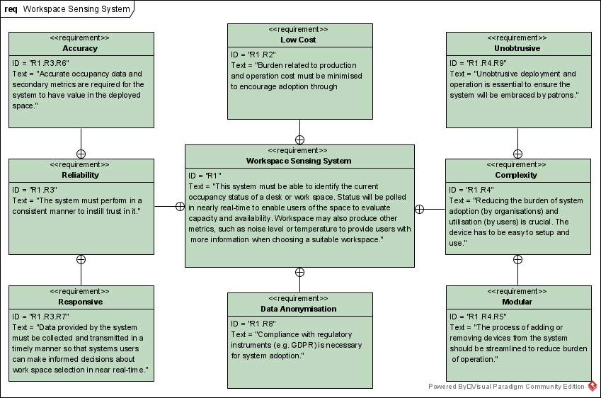

# Building A More Intelligent Library
## Bournemouth University Thesis Project

***

## Table of Contents

1. [Project Description](#project-description-abstract)

2. [Project Requirements](#project-requirements)

3. [Device Implementations](#device-implementations)

   * [Desk Sensor](#desk-sensor) ([Desk Sensor Code](./code/desk-sensor/))

   * [Sensor Bridge](#sensor-bridge) ([Sensor Bridge Code](./code/bridge/))

***

## Project Description (Abstract)
The paradigm of what comprises an effective library is changing as the needs of library users shift. Transitioning from a ‘dumb’ library of the past to a smart library of the future requires the strategic deployment of IoT systems to efficiently tackle the new demands. One vital application for smart library IoT devices would be in occupancy sensing, which is especially desired by users of university libraries. Desk-based occupancy sensors would reduce burdens faced by patrons when searching for a suitable workspace. A solution would need to be robust enough to deal with obstructions to data transmissions while being simple enough to not deter adoption. Deployment of a mesh-based desk sensor network can help limit complexity of individual devices while providing obstruction avoidance through a multi-hop transmission protocol. Artefact development culminated in a device whose core components consists of an ESP32 microcontroller and a single cell thermal sensor. Evaluation of the artefact shows the proposed solution can provide a reliable metric with regards to the current availability status of a workspace.

***

## Project Requirements

***

## Device Implementations

### Desk Sensor

**Hardware**
  * Microcontroller       ESP32-WROOM
  * Thermopile Sensor     MLX90614
  * Loudness Sensor       KY-037 (Optional)
  
This is the sketch code for the desk occupancy sensor node. This sketch will start by creating a node ID that is uniquely set via hardware attributes to ensure each node has a unique ID set automatically. It will use the onboard thermal sensor to measure the current room temperature, calculate if the seat is occupied, sample the level of human perceived loudness at the area of the sensor, and then package all of that information into a custom struct to send via the ESP-Now protocol. The system will then sleep for a predetermined amount of time (as set in the creds.h file) before repeating the process. ESP specific functions are used in this sketch to enable deep sleep and variable retention functionality.

***

### Sensor Bridge

**Hardware**
  * Microcontroller       ESP32-WROOM

This is the sketch code for the desk occupancy bridge node. This sketch will create a node that will continually listen for an ESP-Now message. Upon receiving one, it will upload the message to an MQTT stream with the sender's node ID as the feed path.

Please note that although this bridge node does receive several data metrics from the desk occupancy nodes, it only forwards the occupancy status metric onto the MQTT server. This is necessary due to limitations with my MQTT service and its inability to parse JSON messages. All of the various metrics are received by this bridge though,so they could be theoretically sent via MQTT if a different provider was used.

***